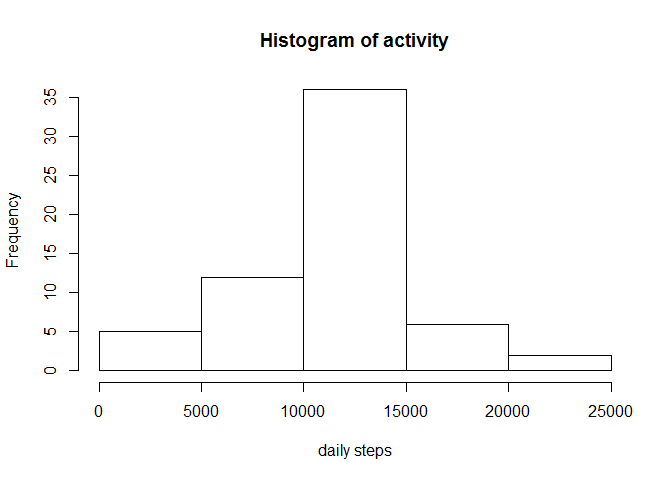

# Reproducible Research: Peer Assessment 1


## Loading and preprocessing the data

```r
setwd("C:\\Users\\diane\\Desktop\\gitRepo\\RepData_PeerAssessment1")
datfile="https://d396qusza40orc.cloudfront.net/repdata%2Fdata%2Factivity.zip"
destfile="dat.zip"
download.file(datfile, destfile)
unzip(destfile)
act=read.csv("activity.csv")
head(act)
```

```
##   steps       date interval
## 1    NA 2012-10-01        0
## 2    NA 2012-10-01        5
## 3    NA 2012-10-01       10
## 4    NA 2012-10-01       15
## 5    NA 2012-10-01       20
## 6    NA 2012-10-01       25
```

## What is mean total number of steps taken per day?

###Data will be processed ignoring all of the missing values. First I will drop all of the NA values and calculate the number of steps taken per day, then I will create a histogram of the number of steps, and last I will calculate daily mean and median daily step values.


```r
act2=act[is.na(act$steps)==FALSE,]
act2$date=factor(act2$date)
dailySteps=tapply(act2$steps, list(act2$date), sum)
hist(dailySteps, main="Histogram of activity", xlab="daily steps")
```

<!-- -->

```r
meanStep=mean(dailySteps)
medianStep=median(dailySteps)
```
###There was a mean of 10766.19 and a median of 10765 steps taken per day.

## What is the average daily activity pattern?
###Below is a time series plot of average steps per 5 minute intervals across all days.

```r
avgInterval=aggregate(act2$steps, list(act2$interval),mean)
plot(x~Group.1, data=avgInterval, type="l",xlab="minutes in day", 
     ylab="average number of steps")
```

<!-- -->

```r
maxSteps=max(avgInterval$x)
maxInt=avgInterval$Group.1[avgInterval$x==maxSteps]
```
###On average, interval 835 contains the maximum number of steps

## Imputing missing values

```r
numNA=length(which(is.na(act$steps)==TRUE))
```

###There are 2304 missing values in the dataset. I am going to fill in the missing values using the mean value for the 5-minute interval. I first tried the median value, but the daily step count based on that data was much too low. It seems like most days the individual was very activity  for part of the day every day, but that for most intervals for most days, very few steps were walked.


```r
actmerge=merge(act, avgInterval, by.y="Group.1", by.x="interval")
actmerge$stepsupdate=ifelse(is.na(actmerge$steps)==TRUE, actmerge$x, actmerge$steps)
dailySteps2=tapply(actmerge$stepsupdate, list(actmerge$date), sum)
hist(dailySteps2, main="Histogram of activity", xlab="daily steps")
```

<!-- -->

```r
meanStep2=mean(dailySteps2)
medianStep2=median(dailySteps2)
median=c(medianStep, medianStep2)
mean=c(meanStep, meanStep2)
compareTable=rbind(median, mean)
colnames(compareTable)=c("NA removed", "NA imputed")
compareTable
```

```
##        NA removed NA imputed
## median   10765.00   10766.19
## mean     10766.19   10766.19
```

###There was a mean of 10766.19 and a median of 10766.19 steps taken per day when values were imputed for the missing values. As shown in the table above, the mean value did not change with the imputed values while the median value changed by a value of 1.19. The dataset only has missing values for entire days, not for just some intervals within a day. The sum of the average value for each time interval is equal to the sum of the average value for a day, so it makes sense that the mean value did not change.

## Are there differences in activity patterns between weekdays and weekends?


```r
mydate <- factor("1/15/2006 0:00:00")
actmerge$date2=as.Date(actmerge$date, format = "%Y-%m-%d")
actmerge$dayOfWeek=weekdays(actmerge$date2)
actmerge$dayType=ifelse(actmerge$dayOfWeek %in% c("Saturday", "Sunday"),
        "weekend", "weekday")
ag=aggregate(actmerge$stepsupdate, by=list(actmerge$interval, actmerge$dayType), mean)
colnames(ag)=c("interval", "dayType", "meanSteps")
library(ggplot2)
```

```
## Need help getting started? Try the cookbook for R:
## http://www.cookbook-r.com/Graphs/
```

```r
qplot(interval, meanSteps, data=ag, geom="line",facets=dayType~.,
    xlab="5-minute interval", ylab="mean steps") 
```

<!-- -->

###The plots show a different pattern between weekday and weekend activities.On weekdays,the individual becomes active earlier in the day than on weekends and tends to concentrate most of the activity shortly after waking up, followed bylower levels of activity the rest of the day. On the weekends, the indivual appears to sleep in later and go to bed later and spread the activity out across the entire day, though the mean peak of activity is still at a similar time.


